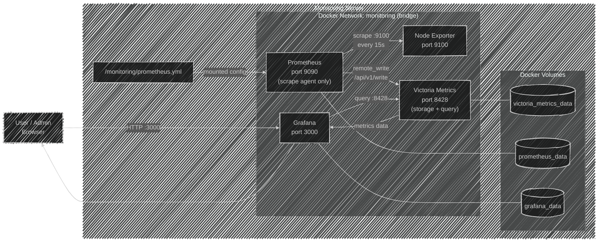

# Architecture

## Workflow

1. User opens browser and accesses Grafana on port 3000
2. Prometheus continuously scrapes Node Exporter every 15s to collect host metrics (CPU, memory, disk, network)
3. Prometheus remote_writes the collected metrics into VictoriaMetrics for persistent storage
4. Grafana sends a query to VictoriaMetrics on port 8428 when user opens a dashboard
5. VictoriaMetrics processes the query and returns the metrics data back to Grafana
6. Grafana renders the data as visualizations and serves the dashboard back to the user's browser

